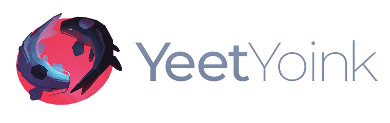

 <div align="center">
    
</div>

YeetYoink (YY for short) is a dynamically typed programming language that combines functional and imperative programming paradigms.

Take YY out for a spin in [the interactive playground](https://mroz.dev/yy).

# Key features

- **Keywords start with 'y'**. With all keywords starting with a big, bold 'y', you'll never forget what language you're coding in.
- **YOLO mode**. When you're ready to let loose and have some fun, switch on YOLO mode and ignore those pesky compiler errors. YY will try its best to execute the code, but results may vary. Play stupid games, win stupid prizes.
- **Everything is an expression.** Even statements like control flow constructs (yif, yall, etc.) and yassignments yeet a value. This allows for a more concise and expressive code - peak efficiency unlocked.
- **First-class functions.** Functions are first-class citizens, meaning they can be passed around like hot potatoes, yeeted as values, and stored in data structures like arrays and hashmaps.
- **Closures.** Functions capture variables from their surrounding scope, making them more powerful and flexible than your above average yak.
- **REPL**. YY comes with a REPL (Read-Eval-Print Loop), allowing you to try out code snippets, experiment, and test your functions on the fly.


# Quick tour

For more details, check out [examples](examples) directory or [live playground](https://mroz.dev/yy).

## Hello world

```c
// print with yap() 
name := "Yennefer"
yap("Hello, {name}!") // "Hello, Yennefer!"

// or yowl() if urgent
yowl("Hello, {name}!") // "HELLO, YENNEFER!"
```

## Variables

```c
a := 5 // variables are declared and assigned using walrus operator
a = 9  // variable assignment, variables must be declared before use

// supported types: integer, string, bool, null
my_yint := 5
my_yarn := "how long is a piece of string?"
my_yup  := true
my_void := null
```

## Control flow

```c
yif 2 * 2 > 10 {
   "that's untrue"
} yels yif 8 + 8 < 4 {
   "yup, that's our stop"
} yels {
    "math.exe stopped working"
}
```

## Loops

```c
// yall (y'all) yeeterates over a collection
// variable 'yt' (short for yeeterator) is created automatically in the loop's scope
yall 0..3 {
    yap(yt) // 0, 1, 2, 3
}

yarray := [1, 2, 3]
sum    := 0
yall elt: yarray { // optionally, you can name the yeeterator
    sum += elt
}

yap(sum) // 6
```


```c
// 2nd looping contruct: 'yoyo'
// the keyword is inspired by the motion of a yoyo going up and down
i := 0
yoyo i < 5 { // body executes while the condition is truthy
    i += 1
}
```

## Data structures

```c
my_array := [7, true, "hello", null, [2, "inception"]]

yap(my_array[2]) // "hello"
```

```c
my_hashmap := %{
    "name":  "Yakub the Yak",
    "age":   2,
    "alive": true,
    42:      "integer key works too",
}

yap(my_hashmap["name"], "is", my_hashmap["age"], "years old.") // "Yakub the Yak is 2 years old."
```

## Functions

```c
// anonymous functions (lambdas) are declared using '\'
// (if you squint hard enough, '\' looks kinda like a lambda 'λ')
max := \a b {
    yif a > b {
        yeet a // yeets the value and returns from the function
    }
    yeet b
}

// 'yeet' keyword can be omitted, last statement in a block is yeeted implicitly
max2 := \a b {
    yif a > b {
        a
    } yels {
        b
    }
}

max(20, 5) // 20
```

```c
// recursion
factorial := \n {
    yif n == 0 {
        1
    } yels {
        n * factorial(n-1)
    }
}

factorial(5) // 120
```

```c
// higher-order functions
add_three  := \x { x + 3 }
call_twice := \fn x { fn(fn(x)) }
call_twice(add_three, 5) // 11
```

```c
// closures
new_adder := \x {
    \n { x + n }
}

add_two := new_adder(2)
add_two(5) // 7
```

## Yolo Mode

```c
// mixing types would normally cause an error:
c := 8 * "string" // runtime error: "type mismatch: INTEGER * STRING"

// assignment to a variable that hasn't been declared would normally error:
new_var = 5 // runtime error: "identifier not found: new_var"

// but in Yolo Mode, anything goes:

yolo {
    yap("tree" * 18)   // "forest"
    yap("troll" * 3)   // "trolltrolltroll"
    yap("2" * 5)       // 10
    yap([1, 2, 3] * 3) // [3, 6, 9]

    // this works even though new_var hasn't been declared first
    new_var = 5

    // variables can be baked into a function
    greet     := \name { "Hello, {name}!" }
    greet_yan := greet + "Yan"
    greet_yan() // "Hello, Yan!"

    // you can specify which argument you want to bake in by adding a function to a hashmap
    add   := \a b { a + b }
    add11 := add + %{ "b": 11 } // baking 'b' into 'add'
    // line above creates function equivalent to:
    // add11 := \a { a + 11 }
    add11(6) // 17

    // but even in yolo mode, division by zero doesn't end well (what did you expect?)
    yap("weee" / 0) // "Stare at the abyss long enough, and it starts to stare back at you."
}
```


# Usage

Build with

```
$ go build
```

Run a YY script

```
$ ./yy filename
```

Or start a REPL session

```
$ ./yy 
```


# More features

- **Two data structures.** YY supports arrays and hashmaps, providing twice as many data structures as Lua.
- **Very basic data types**. YY supports the basic data types of yinteger, string, bool and null. And yes, null isn't technically a data type.
- **Optional semicolons.** YY has taken the modern approach of making semicolons optional, allowing for a cleaner codebase (semicolons are so 1970s anyway).
- **Garbage collected.** YY's automated memory management, also known as the code-cleaning yoyoi, takes care of freeing up memory so you don't have to. It's like having a furry friend who loves to tidy up after you, without the added hassle of having to feed it.
- **Not Object-Oriented.** You don't have to wrap your head around inheritance hierarchy if there's no inheritance hierarchy. Also, OOP is dead, haven't you heard the news. 
- **No exception handling**. No more wrangling with complex error handling mechanisms. In YY, you can throw an exception, but there is no mechanism for catching it (we're not half-assing it like Go, with its weird panic-recover mechanism).
- **Built-in functions.** YY's built-in functions are so reliable, you could trust them with your firstborn child. Just kidding, please don't do that. 
- **No dependencies.** Unlike your needy ex, YY doesn't rely on anyone else. With no bloated third-party libraries weighing it down, YY is as nimble as a young yak frolicking in a field. Also, you won't need to worry about some random person in Nebraska giving up on thanklessly maintaining a package you depend on.
- **Tree walking interpreter.** YY's interpreter may not be the most efficient, but it sure is leisurely. Sit back, relax, and let YY take its time to execute your code. You deserve a break anyway.


# FAQ

## Why is the project called YeetYoink?

Yeet and Yoink symbolise two complementary, yoyo opposing forces that exist in the universe. Everything has both Yeet and Yoink aspects and they are interconnected and interdependent. Together, Yeet and Yoink form a whole, and the balance between the two is necessary for harmony and balance in the universe.

## What's the deal with the fishies in the logo?

They are two koi fish and they are the mascot for the project. The dark one is called Yeet and is passive, negative, and feminine. The bright one is called Yoink and is active, positive, and masculine.

## Can this language be used for serious business?

Of course, why do you ask.

## Has anyone actually asked these questions?

No, I made this section up.
